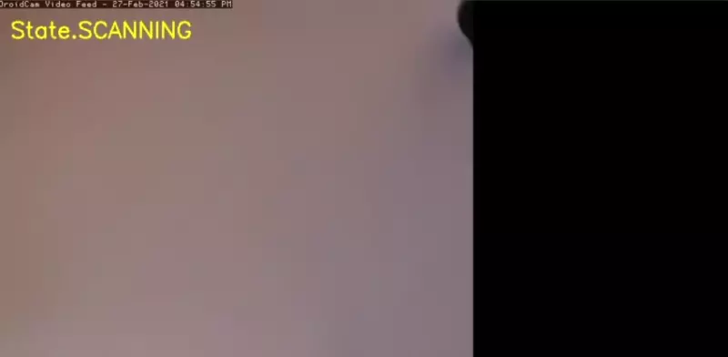

# TCG Scanner

A proof-of-concept project for a Trading Card Game card scanner. The motivation
behind the project is to learn about various topics of image processing, know
how to implement them and apply them to solve a real world problem.

## Current approach

Current approach involves traditional approaches:

1. Detection phase - we want to detect the card in the image and crop it out of
the image. We warp the crop to rectangle.
   - Thresholding
   - Contouring
   - Finding the convex hull
   - Approximate a rectangle shape by Ramer–Douglas–Peucker algorithm
   - Warp by longest edges
2. Search phase - we want to retrieve the card from predefined database. We
achieve this by storing the card hashes and find the most similar ones of the
detected card.
   - Build a database of hashes (we use difference hash) of ground truth cards
   - We hash the detected card and find the most similar hash in our database
      (minimal Hamming's distance)

## Demo

## Future work

- Detection phase with Deep Learning
  - Probably use semantic segmentation  
    - <https://github.com/qubvel/segmentation_models>
    - [This](https://openaccess.thecvf.com/content_cvpr_2018/papers/Ma_DocUNet_Document_Image_CVPR_2018_paper.pdf) architecture warps
  text documents (document scanners). Interesting idea but it seeems like an
  overkill.
- The hash database is just a Python dictionary. I am naively searching in a
linear fashion. The complexity can be improved with data structures that are
appropriate for similarity search e.g. VP-trees. Alternatively, if we would like
to have a real-world sized database we could use Postgre database as it (AFAIK)
has implemented Hamming distance similarity search.

## Sources

- <https://www.pyimagesearch.com/2019/08/26/building-an-image-hashing-search-engine-with-vp-trees-and-opencv/>
